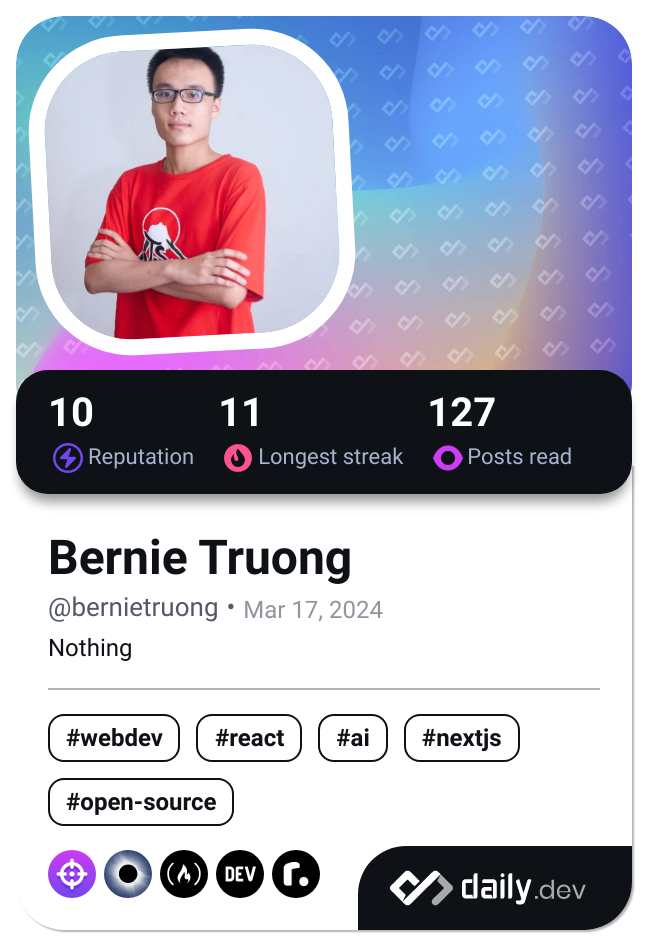

[](https://git.io/typing-svg)

<div align="center">
   <a href="https://app.daily.dev/bernietruong">
      
   </a>
</div>

[](https://github.com/ryo-ma/github-profile-trophy)


<picture>
  <source
    media="(prefers-color-scheme: dark)"
    srcset="https://raw.githubusercontent.com/i-am-truong/i-am-truong/output/github-contribution-grid-snake-dark.svg"
  />
  <source
    media="(prefers-color-scheme: light)"
    srcset="https://raw.githubusercontent.com/i-am-truong/i-am-truong/output/github-contribution-grid-snake.svg"
  />
  
</picture>

<!--START_SECTION:waka-->


**🐱 My GitHub Data** 

> 📦 163.0 kB Used in GitHub's Storage 
 > 
> 🏆 1,089 Contributions in the Year 2025
 > 
> 💼 Opted to Hire
 > 
> 📜 23 Public Repositories 
 > 
> 🔑 9 Private Repositories 
 > 
**I'm an Early 🐤** 

```text
🌞 Morning                706 commits         ████████░░░░░░░░░░░░░░░░░   30.99 % 
🌆 Daytime                829 commits         █████████░░░░░░░░░░░░░░░░   36.39 % 
🌃 Evening                627 commits         ███████░░░░░░░░░░░░░░░░░░   27.52 % 
🌙 Night                  116 commits         █░░░░░░░░░░░░░░░░░░░░░░░░   05.09 % 
```
📅 **I'm Most Productive on Thursday** 

```text
Monday                   343 commits         ████░░░░░░░░░░░░░░░░░░░░░   15.06 % 
Tuesday                  297 commits         ███░░░░░░░░░░░░░░░░░░░░░░   13.04 % 
Wednesday                306 commits         ███░░░░░░░░░░░░░░░░░░░░░░   13.43 % 
Thursday                 469 commits         █████░░░░░░░░░░░░░░░░░░░░   20.59 % 
Friday                   292 commits         ███░░░░░░░░░░░░░░░░░░░░░░   12.82 % 
Saturday                 341 commits         ████░░░░░░░░░░░░░░░░░░░░░   14.97 % 
Sunday                   230 commits         ███░░░░░░░░░░░░░░░░░░░░░░   10.10 % 
```


📊 **This Week I Spent My Time On** 

```text
🕑︎ Time Zone: Asia/Ho_Chi_Minh

💬 Programming Languages: 
No Activity Tracked This Week

🔥 Editors: 
No Activity Tracked This Week

🐱‍💻 Projects: 
No Activity Tracked This Week

💻 Operating System: 
No Activity Tracked This Week
```

**I Mostly Code in JavaScript** 

```text
JavaScript               14 repos            ██████████░░░░░░░░░░░░░░░   41.18 % 
TypeScript               12 repos            █████████░░░░░░░░░░░░░░░░   35.29 % 
Java                     5 repos             ████░░░░░░░░░░░░░░░░░░░░░   14.71 % 
Go                       1 repo              █░░░░░░░░░░░░░░░░░░░░░░░░   02.94 % 
Python                   1 repo              █░░░░░░░░░░░░░░░░░░░░░░░░   02.94 % 
```


**Timeline**


 Last Updated on 26/12/2025 17:17:24 UTC
<!--END_SECTION:waka-->


[](https://github.com/anuraghazra/github-readme-stats)


[](https://github.com/piyushsuthar/github-readme-quotes)


# Latest blog posts
<!-- BLOG-POST-LIST:START -->
- [How I Built a Real-Time Physics Engine for Electrical Engineering with Flutter](https://dev.to/rubenortz_/how-i-built-a-real-time-physics-engine-for-electrical-engineering-with-flutter-2jfh)
- [Scale by Subtraction: An Engineering Leader’s View on Practical AI](https://dev.to/mosiddi/scale-by-subtraction-an-engineering-leaders-view-on-practical-ai-4iba)
- [Adding a Simple Summary at the Top of a Complex Page](https://dev.to/wang_wei_7bca82af800c6f68/adding-a-simple-summary-at-the-top-of-a-complex-page-23d4)
- [Building Reusable UI in React: Compound Components, Render Props, and API Design](https://dev.to/ward_khaddour/building-reusable-ui-in-react-compound-components-render-props-and-api-design-38lg)
- [AI Trading Daily Report: December 26, 2025 | $+189.98](https://dev.to/igorganapolsky/ai-trading-daily-report-december-26-2025-18998-2838)
<!-- BLOG-POST-LIST:END -->

<!-- START gadpp -->
