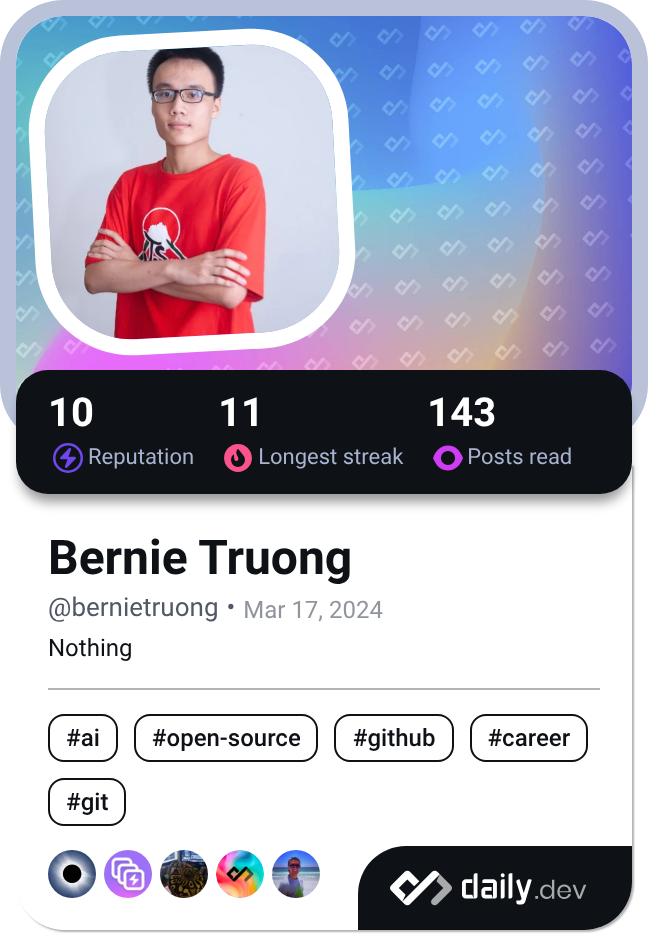

[](https://git.io/typing-svg)

<div align="center">
   <a href="https://app.daily.dev/bernietruong">
      
   </a>
</div>

[](https://github.com/ryo-ma/github-profile-trophy)


<picture>
  <source
    media="(prefers-color-scheme: dark)"
    srcset="https://raw.githubusercontent.com/i-am-truong/i-am-truong/output/github-contribution-grid-snake-dark.svg"
  />
  <source
    media="(prefers-color-scheme: light)"
    srcset="https://raw.githubusercontent.com/i-am-truong/i-am-truong/output/github-contribution-grid-snake.svg"
  />
  
</picture>

<!--START_SECTION:waka-->


**🐱 My GitHub Data** 

> 📦 163.1 kB Used in GitHub's Storage 
 > 
> 🏆 1,089 Contributions in the Year 2025
 > 
> 💼 Opted to Hire
 > 
> 📜 23 Public Repositories 
 > 
> 🔑 9 Private Repositories 
 > 
**I'm an Early 🐤** 

```text
🌞 Morning                711 commits         ████████░░░░░░░░░░░░░░░░░   30.95 % 
🌆 Daytime                839 commits         █████████░░░░░░░░░░░░░░░░   36.53 % 
🌃 Evening                631 commits         ███████░░░░░░░░░░░░░░░░░░   27.47 % 
🌙 Night                  116 commits         █░░░░░░░░░░░░░░░░░░░░░░░░   05.05 % 
```
📅 **I'm Most Productive on Thursday** 

```text
Monday                   347 commits         ████░░░░░░░░░░░░░░░░░░░░░   15.11 % 
Tuesday                  297 commits         ███░░░░░░░░░░░░░░░░░░░░░░   12.93 % 
Wednesday                307 commits         ███░░░░░░░░░░░░░░░░░░░░░░   13.37 % 
Thursday                 474 commits         █████░░░░░░░░░░░░░░░░░░░░   20.64 % 
Friday                   295 commits         ███░░░░░░░░░░░░░░░░░░░░░░   12.84 % 
Saturday                 343 commits         ████░░░░░░░░░░░░░░░░░░░░░   14.93 % 
Sunday                   234 commits         ███░░░░░░░░░░░░░░░░░░░░░░   10.19 % 
```


📊 **This Week I Spent My Time On** 

```text
🕑︎ Time Zone: Asia/Ho_Chi_Minh

💬 Programming Languages: 
No Activity Tracked This Week

🔥 Editors: 
No Activity Tracked This Week

🐱‍💻 Projects: 
No Activity Tracked This Week

💻 Operating System: 
No Activity Tracked This Week
```

**I Mostly Code in JavaScript** 

```text
JavaScript               14 repos            ██████████░░░░░░░░░░░░░░░   41.18 % 
TypeScript               12 repos            █████████░░░░░░░░░░░░░░░░   35.29 % 
Java                     5 repos             ████░░░░░░░░░░░░░░░░░░░░░   14.71 % 
Go                       1 repo              █░░░░░░░░░░░░░░░░░░░░░░░░   02.94 % 
Python                   1 repo              █░░░░░░░░░░░░░░░░░░░░░░░░   02.94 % 
```


**Timeline**


 Last Updated on 29/12/2025 17:18:54 UTC
<!--END_SECTION:waka-->


[](https://github.com/anuraghazra/github-readme-stats)


[](https://github.com/piyushsuthar/github-readme-quotes)


# Latest blog posts
<!-- BLOG-POST-LIST:START -->
- [React tip:
Don’t wait for full JSON responses.

Stream it 👇
fetchStream&lpar;&quot;/api/users&quot;&rpar;.live&lpar;setState&rpar;
Faster perceived performance, better UX.

Guide:
https://dev.to/coding_inblood_7cb339747/react-fetchstream-js-render-json-as-it-arrives-3603](https://dev.to/coding_inblood_7cb339747/react-tip-dont-wait-for-full-json-responses-stream-it-js-55g5)
- [&quot;I Pointed Claude Code at Google&#39;s Antigravity — Here&#39;s the 5-Minute OAuth Setup&quot;](https://dev.to/codekingai/i-pointed-claude-code-at-googles-antigravity-heres-the-5-minute-oauth-setup-45bp)
- [Deploying Apache Superset on Azure From Scratch: My CCF501 Assessment 3](https://dev.to/lfariaus/deploying-apache-superset-on-azure-from-scratch-my-ccf501-assessment-3-27c7)
- [🦀 ZeroClaw Deep Dive 🤖 — A Build-It-Yourself Guide 📘](https://dev.to/truongpx396/zeroclaw-deep-dive-a-build-it-yourself-guide-1hmi)
- [How to Set Up Developer Metrics for 500+ Engineers Using Linear 2.0, Grafana 11.0, and PostHog 3.0](https://dev.to/johalputt/how-to-set-up-developer-metrics-for-500-engineers-using-linear-20-grafana-110-and-posthog-30-3l73)
<!-- BLOG-POST-LIST:END -->

<!-- START gadpp -->
